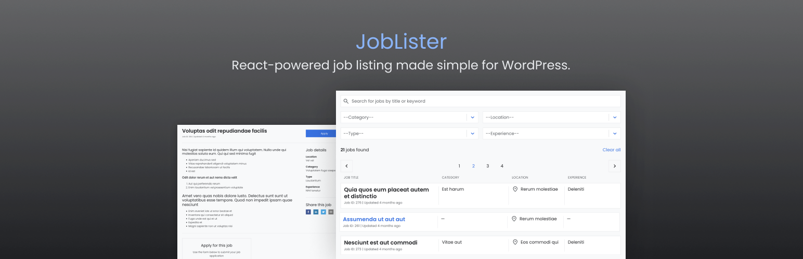

# JobLister



## Description

JobLister is a free and open-source WordPress plugin that allows you to set up a job listing page on your WordPress website using a simple `[joblister]` shortcode. The plugin is powered by React and functions as a Single-page app, providing a range of features including a search functionality, filters, an application form, and a RTL-ready design.

## Installation

To install JobLister, follow these steps:

1. Clone repository and navigate to the newly created directory:
  ```sh
  git clone https://github.com/PictureElement/joblister.git
  cd joblister
  ```

2. Install dependencies:
  ```sh
  npm install
  ```

3. In WP Admin, install and activate the [Radio Buttons for Taxonomies](https://wordpress.org/plugins/radio-buttons-for-taxonomies/) plugin.

4. In WP Admin, generate a new *Application Password* from the Edit User page. Note down the username and password.

5. [Sign up for a Google reCAPTCHA API key pair](http://www.google.com/recaptcha/admin) for your site, choosing "reCAPTCHA v2, Invisible". Note down the API Site Key.

6. Add your settings to the `.env` file:
  ```
  APP_WORDPRESS_USERNAME="YOUR_WORDPRESS_USERNAME"
  APP_APPLICATION_PASSWORD="YOUR_APPLICATION_PASSWORD"
  APP_CAPTCHA_SITE_KEY = "YOUR_CAPTCHA_SITE_KEY"
  ```

7. Build for production:
  ```sh
  npm run build
  ```

8. Create the plugin zip file:
  ```sh
  npm run plugin-zip
  ```

9. Install the plugin zip file in WordPress.

10. Add the `[joblister]` shortcode to your job listing page.

## Features

- **Free and Open Source:**
  - Contribute and improve JobLister together.
- **Versatile Job Listings Display:**
  - **Overview Mode:**
    - List jobs with filters and search.
  - **Detail Mode:**
    - View job details and apply with the form.
- **Efficient Job Search and Filter Functionality:**
  - Filter jobs by keywords, categories, location, type, and experience.
- **Stylish and Customizable Design:**
  - Adjust the theme with Sass variables. Comes with two predefined themes: light and dark.
- **Convenient Pagination:**
  - Navigate job listings with ease.
- **Sharable Links:**
  - Share job listings with others through sharable links.
- **Application Form:**
  - Apply with ease using a form protected by Google reCAPTCHA.
- **Responsive Design:**
  - A seamless experience across all devices.
- **RTL-Ready Design:**
  - Supports Right-to-Left languages.
- **Support for Multiple File Formats:**
  - Upload resumes in various formats.

## Screenshots


## Future Enhancements

1. Retrieve more than 100 records by making multiple API requests and combining the results.
2. Handle form submission errors on the frontend.
3. Properly unistall the plugin. Delete any options or custom tables that the plugin created when it was activated.
4. Internationalization

## Technical Details

### Add Dummy Content Using FakerPress

To make custom post types and custom taxonomies available to FakerPress, set `"public" => true` in the respective post type and taxonomy configurations.

### Generated API Endpoints

- Jobs: `/wp-json/wp/v2/jl-jobs`
- Categories: `/wp-json/wp/v2/jl-categories`
- Locations: `/wp-json/wp/v2/jl-locations`
- Types: `/wp-json/wp/v2/jl-types`
- Experience Levels: `/wp-json/wp/v2/jl-experience-levels`

### Authentication

We utilize the *Application Passwords* feature of WordPress to authenticate our React application, thereby enabling it to make POST requests to the WP REST API.

Please note that *Application Passwords* necessitates an SSL/HTTPS connection as a default security measure.

In case you are operating in a development environment devoid of SSL/HTTPS and wish to test the functionality, override the default requirement by adding the following code to your theme's `functions.php` file:

```php
add_filter( 'wp_is_application_passwords_available', '__return_false' );
```

## Contributing

Your contributions are highly appreciated! If you wish to contribute to this project, please adhere to the following steps:

1. Fork the repository.
2. Create a new branch for your feature or bug fix: `git checkout -b feature/your-feature`.
3. Make your modifications and commit them: `git commit -m 'Add a new feature'`.
4. Push to the branch: `git push origin feature/your-feature`.
5. Open a pull request.

## License

&copy; 2023 [Marios Sofokleous](https://www.msof.me/). Code released under the [GPL-3.0](LICENSE.md) license.