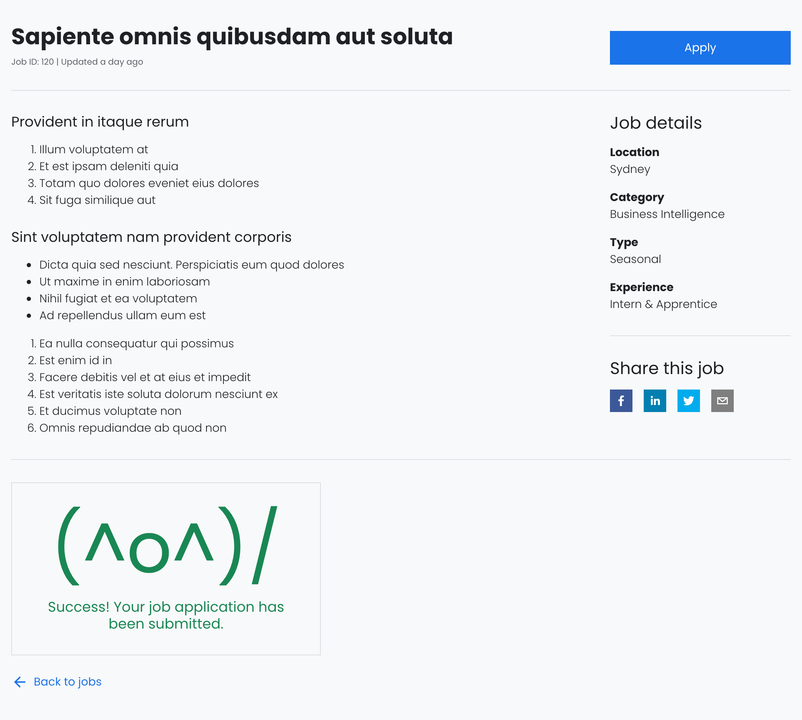
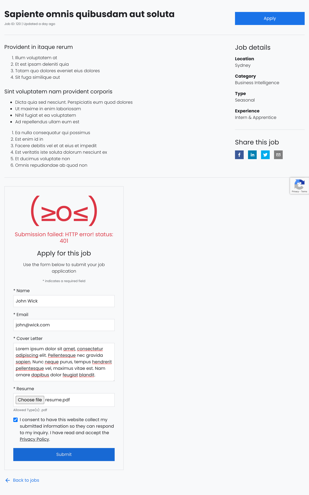
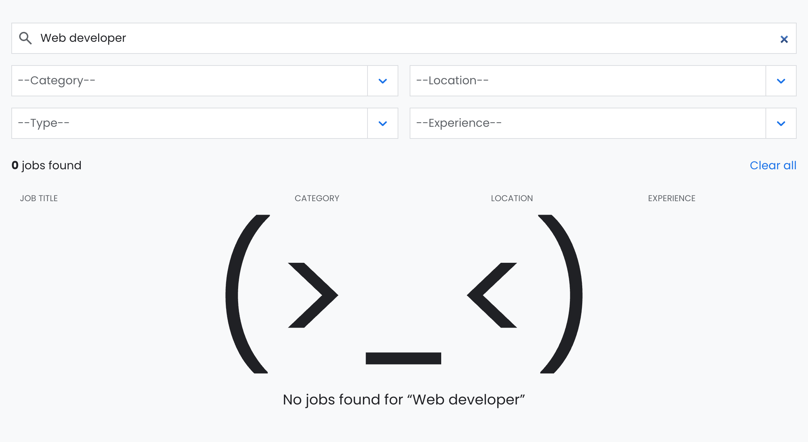
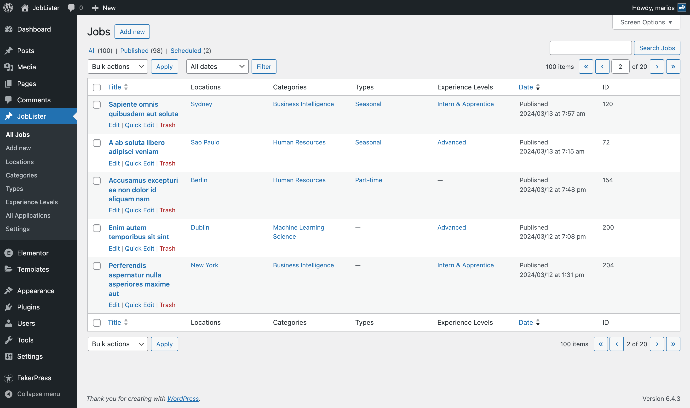
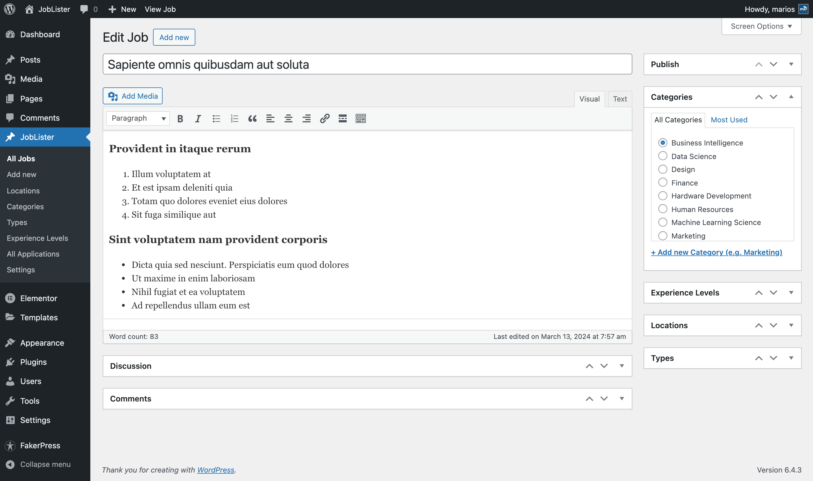
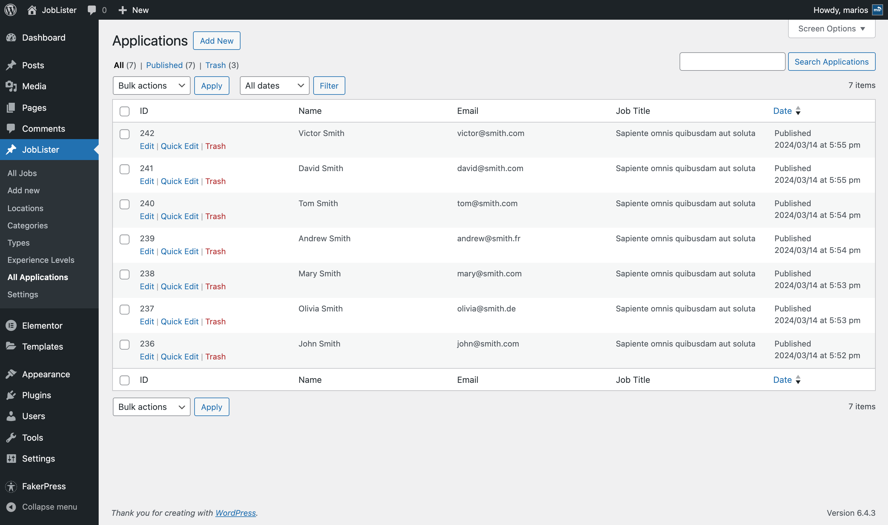

# JobLister


## Description

JobLister is a free and open-source WordPress plugin that allows you to set up a job listing page on your WordPress website using a simple [joblister] shortcode. The plugin is powered by React and functions as a Single-page app, providing a range of features including a search functionality, filters, an application form, and a RTL-ready design.

## Development Setup Instructions

This guide outlines the steps to configure the development environment for JobLister. Follow the instructions closely to ensure a successful setup.

### Prerequisites

- Confirm that Docker Desktop is installed and actively running on your system.
- Install `wp-env` globally on your system if it isn't already installed:

  ```sh
  npm -g i @wordpress/env
  ```

### Enviroment Setup

1. Clone repository and navigate to its directory:

  ```sh
  git clone https://github.com/PictureElement/job-lister.git
  cd job-lister
  ```

2. Install necessary dependencies:

  ```sh
  npm install
  ```

3. Deploy a local WordPress instance:

  ```sh
  wp-env start
  ```

4. Access the WordPress dashboard at [http://localhost:8888/wp-admin/](http://localhost:8888/wp-admin/). Use `admin`/`password` as login credentials.

5. Install and activate the [Radio Buttons for Taxonomies](https://wordpress.org/plugins/radio-buttons-for-taxonomies/) plugin, a required dependency for JobLister to function correctly.

6. Navigate to 'Settings > Radio Buttons for Taxonomies' and select `jl_category`, `jl_experience_level`, `jl_location`, and `jl_type`, and save your changes.

7. To interact with the plugin, insert the [joblister] shortcode on any page.

8. Begin development with fast refresh:

  ```sh
  npm run start:hot
  ```

## Preparing for Production

When ready to move JobLister into a production environment, follow these steps:

1. Navigate to the plugin's directory.

2. Compile the production-ready version:

  ```sh
  npm run build
  ```

3. Create a distributable zip file:

  ```sh
  npm run plugin-zip
  ```

This process compiles all necessary files into a zip format, ready for deployment in a production environment.

## Features

- **Free and Open Source:** Collaborate to improve JobLister with the community.
- **Single Page Application with React:** Offers lightning-fast interactions and a seamless user experience.
- **Versatile Job Listings Display:**
  - **Overview Mode:** List jobs with search and filter capabilities.
  - **Detail Mode:** View job details and apply directly.
- **Efficient Job Search and Filter Functionality:** Narrow down job searches by keywords, categories, location, type, and experience.
- **Customization Settings:** Personalize the appearance and functionality with an intuitive settings page.
- **Convenient Pagination:** Navigate through job listings with ease.
- **Sharable Links:** Share job listings with others through shareable links.
- **Application Form:** Apply easily using a form protected by Google reCAPTCHA.
- **Responsive Design:** Ensures a seamless experience across all devices.
- **RTL-Ready Design:** Supports Right-to-Left languages.
- **Support for Multiple File Formats:** Accept resumes in various formats.

## Screenshots


*Job listings - Frontend*


*No Jobs Found (Searching) - Frontend*


*No Jobs Found (Filtering) - Frontend*


*A single job listing - Frontend*


*Successfull application submission - Frontend*


*The application form - Frontend*


*Job listings - Backend*


*Edit job - Backend*


*Application list - Backend*


*Edit Application - Backend*


*Settings - Backend*

## Future Enhancements

1. Overcoming the current 100-record limit per API request by implementing a system for handling multiple API requests. This will allow for managing larger datasets seamlessly.
2. Work towards removing the 'Radio Buttons for Taxonomies' plugin as a dependency.
3. Expanding language support to make JobLister accessible to a global audience.

## Technical Details

### Add Dummy Content Using FakerPress

To make custom post types and custom taxonomies available to FakerPress, set `"public" => true` in the respective post type and taxonomy configurations. However, it's crucial to revert this setting to `"public" => false` if you're operating in a production environment.

### Generated API Endpoints

- Jobs: `/wp-json/wp/v2/jl-jobs`
- Categories: `/wp-json/wp/v2/jl-categories`
- Locations: `/wp-json/wp/v2/jl-locations`
- Types: `/wp-json/wp/v2/jl-types`
- Experience Levels: `/wp-json/wp/v2/jl-experience-levels`

### Authentication

We utilize the *Application Passwords* feature of WordPress to authenticate our React application, thereby enabling it to make POST requests to the WP REST API.

Please note that this feature necessitates an SSL/HTTPS connection as a default security measure.

In case you are operating in a development environment devoid of SSL/HTTPS and wish to test the functionality, override the default requirement by adding the following code to your theme's `functions.php` file:

```php
add_filter( 'wp_is_application_passwords_available', '__return_false' );
```

## Contributing

Your contributions are highly appreciated! If you wish to contribute to this project, please adhere to the following steps:

1. Fork the repository.
2. Create a new branch for your feature or bug fix: `git checkout -b feature/your-feature`.
3. Make your modifications and commit them: `git commit -m 'Add a new feature'`.
4. Push to the branch: `git push origin feature/your-feature`.
5. Open a pull request.

## License

&copy; 2023 [Marios Sofokleous](https://www.msof.me/). Code released under the [GPL-3.0](LICENSE.md) license.