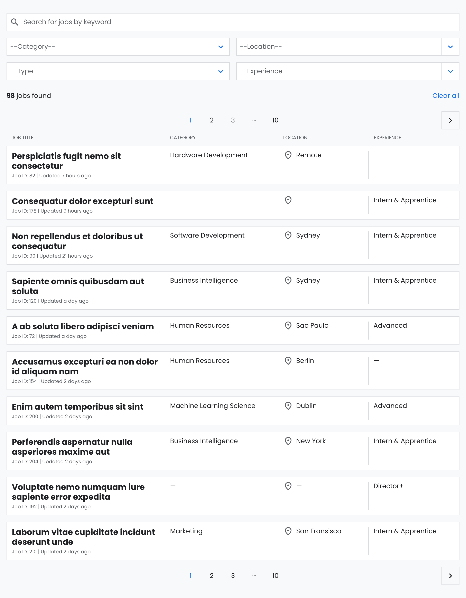
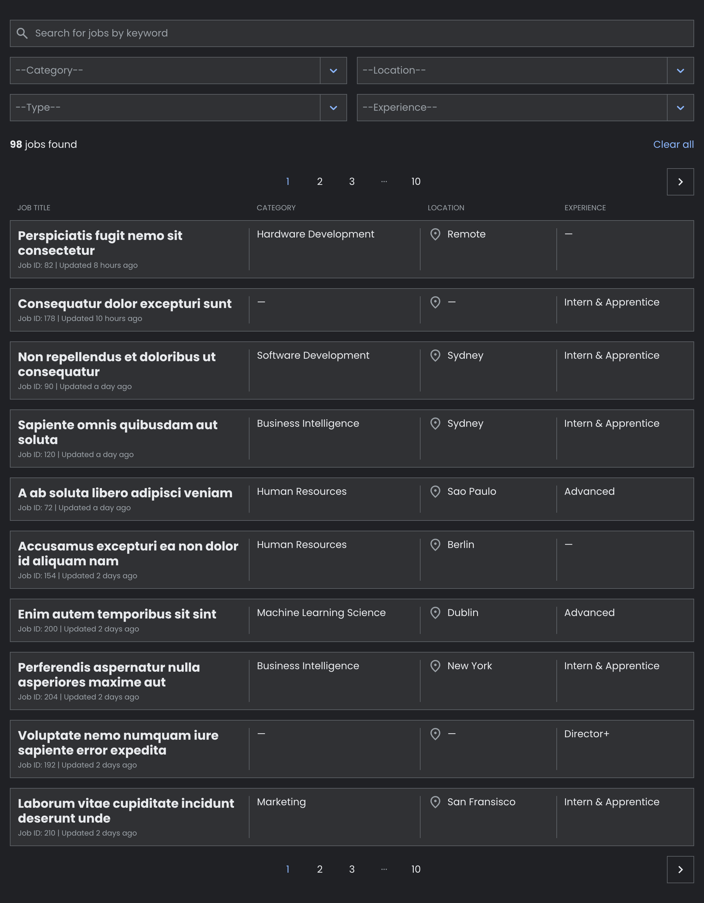
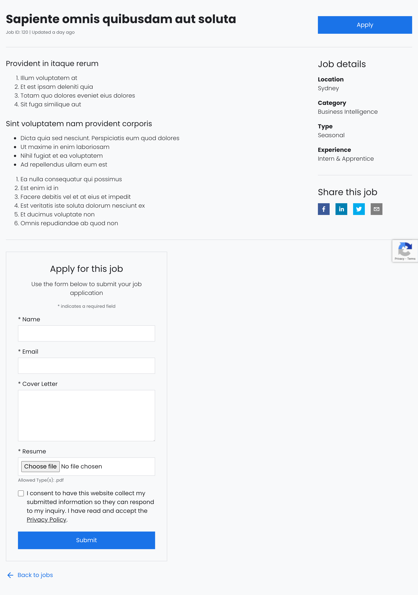
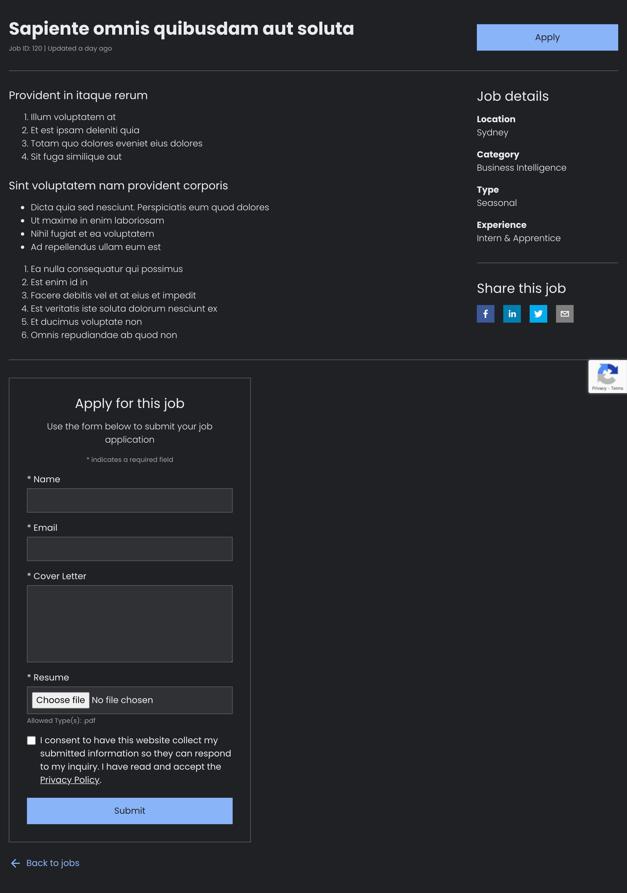

# JobLister


## Description

JobLister is a free and open-source WordPress plugin that allows you to set up a job listing page on your WordPress website using a simple [jbls_jobs] shortcode. The plugin is powered by React and functions as a Single-page app, providing a range of features including a search functionality, filters, an application form, and a RTL-ready design.

**[View Demo](https://joblister.msof.me/)**

## Development Setup Instructions

This guide outlines the steps to configure the development environment for JobLister. Follow the instructions closely to ensure a successful setup.

### Prerequisites

- Confirm that Docker Desktop is installed and actively running on your system.
- Install `wp-env` globally on your system if it isn't already installed:

  ```sh
  npm -g i @wordpress/env
  ```

### Enviroment Setup

1. Clone repository and navigate to its directory:

  ```sh
  git clone https://github.com/PictureElement/joblister.git
  cd joblister
  ```

2. Install necessary dependencies:

  ```sh
  npm install
  ```

3. Deploy a local WordPress instance:

  ```sh
  wp-env start
  ```

4. Access the WordPress dashboard at [http://localhost:8888/wp-admin/](http://localhost:8888/wp-admin/). Use `admin`/`password` as login credentials.

5. Install and activate the [Radio Buttons for Taxonomies](https://wordpress.org/plugins/radio-buttons-for-taxonomies/) plugin, a required dependency for JobLister to function correctly.

6. Navigate to "Settings > Radio Buttons for Taxonomies" and select `jbls_category`, `jbls_experience_level`, `jbls_location`, and `jbls_type`, and save your changes.

7. To interact with the plugin, insert the [jbls_jobs] shortcode on any page.

8. Begin development with fast refresh:

  ```sh
  npm run start:hot
  ```

## Preparing for Production

When ready to move JobLister into a production environment, follow these steps:

1. Navigate to the plugin's directory.

2. Compile the production-ready version:

  ```sh
  npm run build
  ```

3. Create a distributable zip file:

  ```sh
  npm run plugin-zip
  ```

This process compiles all necessary files into a zip format, ready for deployment in a production environment.

## Features

* **Free and Open Source:** Collaborate with the community to improve JobLister.
* **Single Page Application with React:** Offers lightning-fast interactions and a seamless user experience.
* **Versatile Job Listings Display:**
  * **Overview Mode:** List jobs with search and filter capabilities.
  * **Detail Mode:** View job details and apply directly.
* **Efficient Job Search and Filter Functionality:** Narrow down job searches by keywords, categories, location, type, and experience.
* **Enhanced Bookmarking and Sharing:** Utilized filter, page, and query parameters in the URL.
* **Customization Settings:** Personalize appearance and functionality with an intuitive settings page.
* **No Account Required:** Applicants can submit job applications without the need to log in, ensuring a user-friendly and accessible process.
* **Convenient Pagination:** Navigate through job listings with ease.
* **Spam-free submissions:** Use a form protected by Google reCAPTCHA.
* **Responsive Design:** Ensures a seamless experience across all devices.
* **RTL-Ready Design:** Supports right-to-left languages.

## Screenshots


*Job Listings, Search & Filters - Light Theme*


*Job Listings, Search & Filters - Dark Theme*


*Single Job Listing With Application Form - Light Theme*


*Single Job Listing With Application Form - Dark Theme*


*Successful Submission*


*Failed Submission*


*No Jobs Found After Filtering*


*No Jobs Found After Searching*


*Jobs In WP Admin*


*Edit Job In WP Admin*


*Applications In WP Admin*


*Edit Application In WP Admin*


*Settings In WP Admin*

## Future Enhancements

1. Detect network status and alert your users when they've lost internet connectivity. (Offline.js or navigator.onLine).
2. Implement error handling for API GET requests to provide clear user feedback.
3. Accept resumes in more formats.
4. Send notification emails.

## Technical Details

### Add Dummy Content Using FakerPress

To make custom post types and custom taxonomies available to FakerPress, set `"public" => true` in the respective post type and taxonomy configurations. However, it's crucial to revert this setting to `"public" => false` if you're operating in a production environment.

### REST API Routes & Endpoints

The following routes & endpoints are available for interacting with JobLister:

* `wp-json/jbls/v1/jbls-jobs`
  * GET endpoint to fetch all jobs
* `wp-json/jbls/v1/jbls-categories`
  * GET endpoint to fetch all categories
* `wp-json/jbls/v1/jbls-locations`
  * GET endpoint to fetch all locations
* `wp-json/jbls/v1/jbls-types`
  * GET endpoint to fetch all types
* `wp-json/jbls/v1/jbls-experience-levels`
  * GET endpoint to fetch all experience levels
* `wp-json/jbls/v1/jbls-applications`
  * POST endpoint to submit a job application

## Acknowledgements

Special thanks to [Helga the Viking](https://github.com/helgatheviking) for developing the [Radio Buttons for Taxonomies](https://github.com/helgatheviking/Radio-Buttons-for-Taxonomies) plugin, which is a crucial dependency for JobLister.

## Contributing

Your contributions are highly appreciated! If you wish to contribute to this project, please adhere to the following steps:

1. Fork the repository.
2. Create a new branch for your feature or bug fix: `git checkout -b feature/your-feature`.
3. Make your modifications and commit them: `git commit -m 'Add a new feature'`.
4. Push to the branch: `git push origin feature/your-feature`.
5. Open a pull request.

## License

&copy; 2024 [Marios Sofokleous](https://www.msof.me/). Code released under the [GPL-3.0](LICENSE) license.
